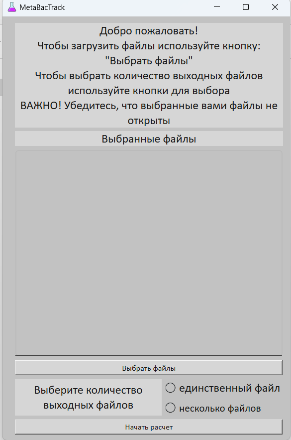
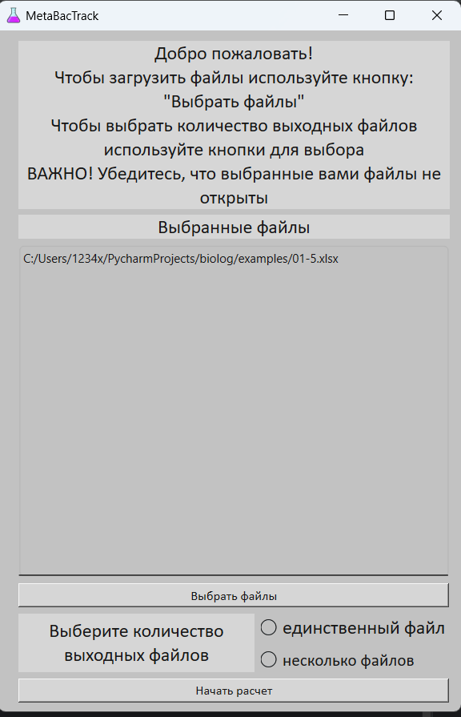
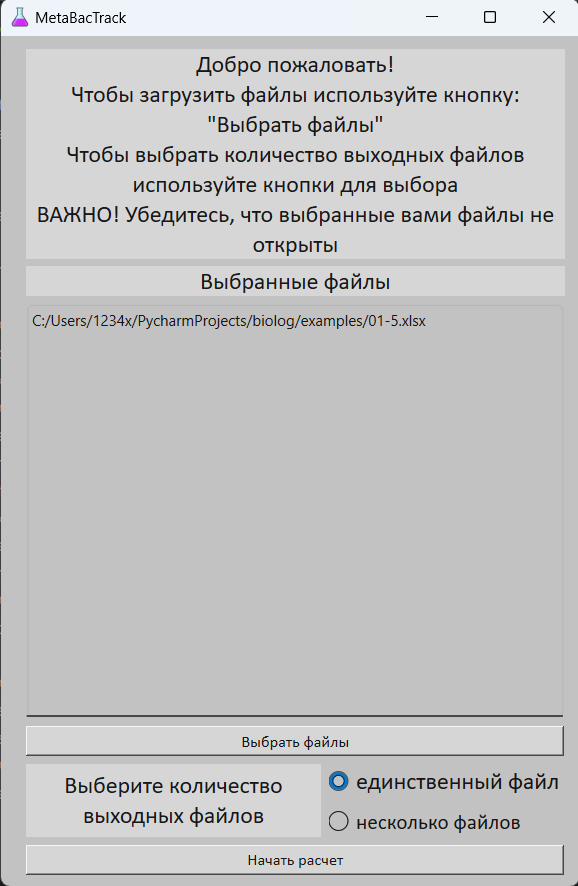

# MetaBacTrack

Metabolic Bacterial Tracking is an interface for optimization of calculating Excel tables which are gotten from the special device. 
The GUI can collect results of calculations into one file column by column or distribute them to different output files.

## How to use?
The interface has calculator similar design, so the usage should be easy.

### 1) Choose files
Choose the tables after pushing the button "Выбрать файлы"
***
### Important!
The Excel tables must have the following structure:

Otherwise, all calculations will be wrong or empty
***
Then you will see the absolute path to the file in the middle window

### 2) Choose output files number
Click the "единственный файл" button if you want to store calculations in one file column by column or "несколько файлов"
if you want to store calculations in several special files.
### 3) Start calculating
Push "Начать расчет" button to start calculating.
***
### Feature:
#### MetaBackTrack accepts only files with extensions <u>.xls</u> or <u>.xlsx</u>. Files with old extensions (<u>.xls</u>) will be converted to .xlsx files for a while, so the copies with .xlsx extension will be deleted in the end of the calculating. The usage of .xlsx files will accelerate the process a little bit, since the stage of conversion will be skipped.
***

If the calculations went successfully, the window as the picture above will be pushed.

Otherwise, something went wrong during execution.

The output file will be named as <b>output.xlsx</b> and stored in the same directory as the chosen files. 
If you have chosen "несколько файлов", therefore, the name of the output files will be "<b>output_</b> + <i>name of the input file</i> + .xlsx" 

